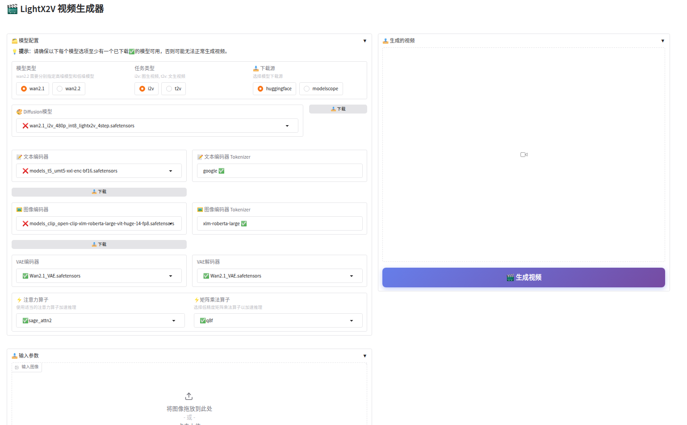

# Gradio 部署指南

## 📖 概述

Lightx2v 是一个轻量级的视频推理和生成引擎，提供基于 Gradio 的 Web 界面，支持图像到视频（Image-to-Video）和文本到视频（Text-to-Video）两种生成模式。

对于Windows系统，我们提供了便捷的一键部署方式，支持自动环境配置和智能参数优化。详细操作请参考[一键启动Gradio](./deploy_local_windows.md/#一键启动gradio推荐)章节。



## 📁 文件结构

```
LightX2V/app/
├── gradio_demo.py          # 英文界面演示
├── gradio_demo_zh.py       # 中文界面演示
├── run_gradio.sh          # 启动脚本
├── README.md              # 说明文档
├── outputs/               # 生成视频保存目录
└── inference_logs.log     # 推理日志
```

本项目包含两个主要演示文件：
- `gradio_demo.py` - 英文界面版本
- `gradio_demo_zh.py` - 中文界面版本

## 🚀 快速开始

### 环境要求

按照[快速开始文档](../getting_started/quickstart.md)安装环境

#### 推荐优化库配置

- ✅ [Flash attention](https://github.com/Dao-AILab/flash-attention)
- ✅ [Sage attention](https://github.com/thu-ml/SageAttention)
- ✅ [vllm-kernel](https://github.com/vllm-project/vllm)
- ✅ [sglang-kernel](https://github.com/sgl-project/sglang/tree/main/sgl-kernel)
- ✅ [q8-kernel](https://github.com/KONAKONA666/q8_kernels) (仅支持ADA架构的GPU)

可根据需要，按照各算子的项目主页教程进行安装。

### 📥 模型下载

可通过前端界面一键下载模型，提供了两个下载源，huggingface和modelscope，可根据自己情况选择
也可参考[模型结构文档](../getting_started/model_structure.md)下载完整模型（包含量化和非量化版本）或仅下载量化/非量化版本。

#### wan2.1 模型目录结构

```
models/
├── wan2.1_i2v_720p_lightx2v_4step.safetensors                   # 原始精度
├── wan2.1_i2v_720p_scaled_fp8_e4m3_lightx2v_4step.safetensors   # FP8 量化
├── wan2.1_i2v_720p_int8_lightx2v_4step.safetensors              # INT8 量化
├── wan2.1_i2v_720p_int8_lightx2v_4step_split                    # INT8 量化分block存储目录
├── wan2.1_i2v_720p_scaled_fp8_e4m3_lightx2v_4step_split         # FP8 量化分block存储目录
├── 其他权重(例如t2v)
├── t5/clip/xlm-roberta-large/google    # text和image encoder
├── vae/lightvae/lighttae               # vae
└── config.json                         # 模型配置文件
```

#### wan2.2 模型目录结构

```
models/
├── wan2.2_i2v_A14b_high_noise_lightx2v_4step_1030.safetensors        # high noise 原始精度
├── wan2.2_i2v_A14b_high_noise_fp8_e4m3_lightx2v_4step_1030.safetensors    # high noise FP8 量化
├── wan2.2_i2v_A14b_high_noise_int8_lightx2v_4step_1030.safetensors   # high noise INT8 量化
├── wan2.2_i2v_A14b_high_noise_int8_lightx2v_4step_1030_split         # high noise INT8 量化分block存储目录
├── wan2.2_i2v_A14b_low_noise_lightx2v_4step.safetensors         # low noise 原始精度
├── wan2.2_i2v_A14b_low_noise_fp8_e4m3_lightx2v_4step.safetensors     # low noise FP8 量化
├── wan2.2_i2v_A14b_low_noise_int8_lightx2v_4step.safetensors    # low noise INT8 量化
├── wan2.2_i2v_A14b_low_noise_int8_lightx2v_4step_split          # low noise INT8 量化分block存储目录
├── t5/clip/xlm-roberta-large/google    # text和image encoder
├── vae/lightvae/lighttae               # vae
└── config.json                         # 模型配置文件
```

**📝 下载说明**：

- 模型权重可从 HuggingFace 下载：
  - [Wan2.1-Distill-Models](https://huggingface.co/lightx2v/Wan2.1-Distill-Models)
  - [Wan2.2-Distill-Models](https://huggingface.co/lightx2v/Wan2.2-Distill-Models)
- Text 和 Image Encoder 可从 [Encoders](https://huggingface.co/lightx2v/Encoders) 下载
- VAE 可从 [Autoencoders](https://huggingface.co/lightx2v/Autoencoders) 下载
- 对于 `xxx_split` 目录（例如 `wan2.1_i2v_720p_scaled_fp8_e4m3_lightx2v_4step_split`），即按照 block 存储的多个 safetensors，适用于内存不足的设备。例如内存 16GB 以内，请根据自身情况下载


### 启动方式

#### 方式一：使用启动脚本（推荐）

**Linux 环境：**
```bash
# 1. 编辑启动脚本，配置相关路径
cd app/
vim run_gradio.sh

# 需要修改的配置项：
# - lightx2v_path: Lightx2v项目根目录路径
# - model_path: 模型根目录路径（包含所有模型文件）

# 💾 重要提示：建议将模型路径指向SSD存储位置
# 例如：/mnt/ssd/models/ 或 /data/ssd/models/

# 2. 运行启动脚本
bash run_gradio.sh

# 3. 或使用参数启动
bash run_gradio.sh --lang zh --port 8032
bash run_gradio.sh --lang en --port 7862
```

**Windows 环境：**
```cmd
# 1. 编辑启动脚本，配置相关路径
cd app\
notepad run_gradio_win.bat

# 需要修改的配置项：
# - lightx2v_path: Lightx2v项目根目录路径
# - model_path: 模型根目录路径（包含所有模型文件）

# 💾 重要提示：建议将模型路径指向SSD存储位置
# 例如：D:\models\ 或 E:\models\

# 2. 运行启动脚本
run_gradio_win.bat

# 3. 或使用参数启动
run_gradio_win.bat --lang zh --port 8032
run_gradio_win.bat --lang en --port 7862
```

#### 方式二：直接命令行启动

```bash
pip install -v git+https://github.com/ModelTC/LightX2V.git
```

**Linux 环境：**

**中文界面版本：**
```bash
python gradio_demo_zh.py \
    --model_path /path/to/models \
    --server_name 0.0.0.0 \
    --server_port 7862
```

**英文界面版本：**
```bash
python gradio_demo.py \
    --model_path /path/to/models \
    --server_name 0.0.0.0 \
    --server_port 7862
```

**Windows 环境：**

**中文界面版本：**
```cmd
python gradio_demo_zh.py ^
    --model_path D:\models ^
    --server_name 127.0.0.1 ^
    --server_port 7862
```

**英文界面版本：**
```cmd
python gradio_demo.py ^
    --model_path D:\models ^
    --server_name 127.0.0.1 ^
    --server_port 7862
```

**💡 提示**：模型类型（wan2.1/wan2.2）、任务类型（i2v/t2v）以及具体的模型文件选择均在 Web 界面中进行配置。

## 📋 命令行参数

| 参数 | 类型 | 必需 | 默认值 | 说明 |
|------|------|------|--------|------|
| `--model_path` | str | ✅ | - | 模型根目录路径（包含所有模型文件的目录） |
| `--server_port` | int | ❌ | 7862 | 服务器端口 |
| `--server_name` | str | ❌ | 0.0.0.0 | 服务器IP地址 |
| `--output_dir` | str | ❌ | ./outputs | 输出视频保存目录 |

**💡 说明**：模型类型（wan2.1/wan2.2）、任务类型（i2v/t2v）以及具体的模型文件选择均在 Web 界面中进行配置。

## 🎯 功能特性

### 模型配置

- **模型类型**: 支持 wan2.1 和 wan2.2 两种模型架构
- **任务类型**: 支持图像到视频（i2v）和文本到视频（t2v）两种生成模式
- **模型选择**: 前端自动识别并筛选可用的模型文件，支持自动检测量化精度
- **编码器配置**: 支持选择 T5 文本编码器、CLIP 图像编码器和 VAE 解码器
- **算子选择**: 支持多种注意力算子和量化矩阵乘法算子，系统会根据安装状态自动排序

### 输入参数

- **提示词 (Prompt)**: 描述期望的视频内容
- **负向提示词 (Negative Prompt)**: 指定不希望出现的元素
- **输入图像**: i2v 模式下需要上传输入图像
- **分辨率**: 支持多种预设分辨率（480p/540p/720p）
- **随机种子**: 控制生成结果的随机性
- **推理步数**: 影响生成质量和速度的平衡（蒸馏模型默认为 4 步）

### 视频参数

- **FPS**: 每秒帧数
- **总帧数**: 视频长度
- **CFG缩放因子**: 控制提示词影响强度（1-10，蒸馏模型默认为 1）
- **分布偏移**: 控制生成风格偏离程度（0-10）

## 🔧 自动配置功能

系统会根据您的硬件配置（GPU 显存和 CPU 内存）自动配置最优推理选项，无需手动调整。启动时会自动应用最佳配置，包括：

- **GPU 内存优化**: 根据显存大小自动启用 CPU 卸载、VAE 分块推理等
- **CPU 内存优化**: 根据系统内存自动启用延迟加载、模块卸载等
- **算子选择**: 自动选择已安装的最优算子（按优先级排序）
- **量化配置**: 根据模型文件名自动检测并应用量化精度


### 日志查看

```bash
# 查看推理日志
tail -f inference_logs.log

# 查看GPU使用情况
nvidia-smi

# 查看系统资源
htop
```

欢迎提交Issue和Pull Request来改进这个项目！

**注意**: 使用本工具生成的视频内容请遵守相关法律法规，不得用于非法用途。
