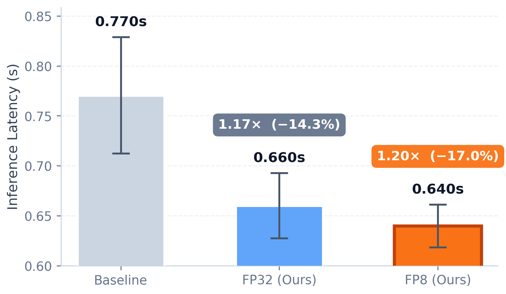

# WorldMirror Examples

This directory contains usage examples for HY-WorldMirror-2.0, a single-step multi-head 3D reconstruction model (depth / normal / camera / points / Gaussian splats) served through the LightX2V runner.

## Benchmark Results

<div align="center">
  
</div>

## Model Download

Before using the example scripts, you need to download the corresponding weights. The model can be downloaded from the following address:

3D Reconstruction Model
- [HY-WorldMirror-2.0](https://huggingface.co/tencent/HY-World-2.0)

The downloaded directory should contain a `HY-WorldMirror-2.0/` subfolder with `model.safetensors` and `config.json` inside.

## Usage Method 1: Using Bash Scripts (Highly Recommended)

For environment setup, we recommend using our Docker image. Please refer to the [Quick Start Guide](../../docs/EN/source/getting_started/quickstart.md).

```
git clone https://github.com/ModelTC/LightX2V.git
cd LightX2V/scripts/worldmirror

# Set lightx2v_path and model_path at the top of the script.
# Edit --input_path and --save_result_path in the command as needed.
```

3D Reconstruction Models
```
# Inference with the fp32 reconstruction model (default precision, 1e-3 MAE vs. upstream reference)
bash run_worldmirror_recon.sh

# Inference with the fp8-pertensor quantized model, saves ~0.6 GB GPU peak at slightly faster speed
# (1e-2 MAE vs. reference). Requires the calibrated input-scale file bundled under
# configs/worldmirror/worldmirror_input_scales.safetensors — already referenced from the config.
bash run_worldmirror_recon_fp8.sh
```

Both scripts include `--save_rendered --render_interp_per_pair 15` to render a Gaussian-splat flythrough
video into `<save_result_path>/<case>/<timestamp>/rendered/rendered_rgb.mp4`. Remove `--save_rendered`
to skip it, or add `--render_depth` to also render a depth flythrough. The SP script uses two GPUs.

Relative `input_scale_file` paths are resolved from the LightX2V repository root; absolute paths are used directly.

## Usage Method 2: Install and Use Python Scripts

For environment setup, we recommend using our Docker image. Please refer to the [Quick Start Guide](../../docs/EN/source/getting_started/quickstart.md).

First, clone the repository and install dependencies:

```bash
git clone https://github.com/ModelTC/LightX2V.git
cd LightX2V
pip install -v -e .
```

Running the Reconstruction Model (fp32)

Run the `test_worldmirror.py` script, which wraps the LightX2V runner with the default fp32 config:

```bash
cd examples/worldmirror/
python test_worldmirror.py \
    --model_path /path/to/HY-World-2.0 \
    --input_path /path/to/scene_dir \
    --save_result_path /path/to/output
```

This is the highest-accuracy path (matches the upstream HY-World-2.0 pipeline within 1e-3 MAE on depth / normal and 1% on point cloud bounding volume).

Running the Reconstruction Model + FP8 Quantization

Run the same entry point with the fp8 config to enable per-tensor fp8 quantization on the covered linear layers:

```bash
cd examples/worldmirror/
python test_worldmirror.py \
    --config_path /workspace/LightX2V/configs/worldmirror/worldmirror_recon_fp8.json \
    --model_path /path/to/HY-World-2.0 \
    --input_path /path/to/scene_dir \
    --save_result_path /path/to/output
```

WorldMirror delivers reconstruction results as files. If `save_result_path` is omitted or `None`, results are saved under `./inference_output/<scene>/<timestamp>/`. `strict_output_path` takes precedence and writes directly to the specified directory.

For the full CLI surface (per-head disable, mask controls, prior camera/depth inputs, Gaussian-splat flythrough rendering, interactive `>>>` loop), use `run_worldmirror.py` instead — it mirrors the original `python -m hyworld2.worldrecon.pipeline` entry point, with output paths named `--save_result_path`:

```bash
python run_worldmirror.py \
    --input_path /path/to/scene_dir \
    --pretrained_model_name_or_path /path/to/HY-World-2.0 \
    --lightx2v_config /workspace/LightX2V/configs/worldmirror/worldmirror_recon_fp8.json \
    --save_rendered --no_interactive
```
