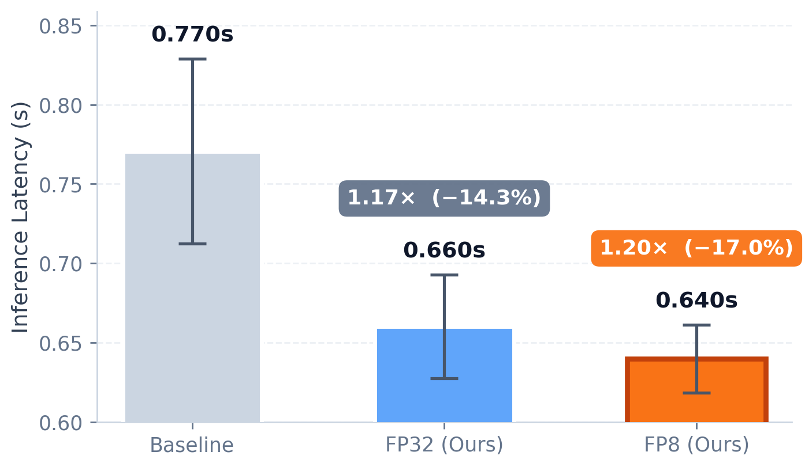

# WorldMirror 示例

本目录存放 HY-WorldMirror-2.0 的使用示例。它是一个单步多头 3D 重建模型（同时输出 depth / normal / camera / points / Gaussian splats），通过 LightX2V runner 运行。

## 推理效果

<div align="center">
  
</div>

## 模型下载

在使用示例脚本之前，需要先下载对应的模型权重，可通过以下地址获取：

3D 重建模型
- [HY-WorldMirror-2.0](https://huggingface.co/tencent/HY-World-2.0)

下载后的目录应包含 `HY-WorldMirror-2.0/` 子文件夹，其中有 `model.safetensors` 和 `config.json`。

## 使用方式一：使用 Bash 脚本（强烈推荐）

环境搭建推荐使用我们提供的 Docker 镜像，详见 [快速上手](../../docs/ZH_CN/source/getting_started/quickstart.md)。

```
git clone https://github.com/ModelTC/LightX2V.git
cd LightX2V/scripts/worldmirror

# 运行下列脚本前，可通过环境变量覆盖 MODEL_PATH / INPUT_PATH / SAVE_RESULT_PATH，
# 或直接修改脚本顶部的默认值。
# 例如：export MODEL_PATH=/home/user/models/HY-World-2.0
# 例如：export INPUT_PATH=/home/user/inputs/Workspace
```

3D 重建模型
```
# fp32 精度推理（默认精度，与上游参考输出的 MAE 在 1e-3 以内）
bash run_worldmirror_recon.sh

# fp8-pertensor 量化推理，显存峰值下降约 0.6 GB，速度略快
# （与参考输出的 MAE 在 1e-2 以内）。所需 input-scale 标定文件
# configs/worldmirror/worldmirror_input_scales.safetensors 已在 config 中引用。
bash run_worldmirror_recon_fp8.sh
```

两个脚本默认 `RENDER_VIDEO=1`，会额外渲染一段 Gaussian-splat 相机插值漫游视频，
落盘到 `<SAVE_RESULT_PATH>/<case>/<timestamp>/rendered/rendered_rgb.mp4`。
设 `RENDER_VIDEO=0` 可关闭渲染；设 `RENDER_DEPTH=1` 可额外输出一段 depth 漫游。

## 使用方式二：安装后使用 Python 脚本

环境搭建推荐使用我们提供的 Docker 镜像，详见 [快速上手](../../docs/ZH_CN/source/getting_started/quickstart.md)。

首先克隆仓库并安装依赖：

```bash
git clone https://github.com/ModelTC/LightX2V.git
cd LightX2V
pip install -v -e .
```

运行 fp32 重建模型

运行 `test_worldmirror.py`，它是 LightX2V runner 的一层精简封装，默认加载 fp32 config：

```bash
cd examples/worldmirror/
python test_worldmirror.py \
    --model_path /path/to/HY-World-2.0 \
    --input_path /path/to/scene_dir \
    --output_path /path/to/output
```

这是精度最高的推理路径，与上游 HY-World-2.0 pipeline 对齐：depth / normal MAE 在 1e-3 以内，点云包围盒体积差异在 1% 以内。

运行 fp8 量化推理

同一入口切换到 fp8 config，即可在覆盖的 linear 层上启用 per-tensor fp8 量化：

```bash
cd examples/worldmirror/
python test_worldmirror.py \
    --config_path /workspace/LightX2V/configs/worldmirror/worldmirror_recon_fp8.json \
    --model_path /path/to/HY-World-2.0 \
    --input_path /path/to/scene_dir \
    --output_path /path/to/output
```

如果需要完整 CLI（逐 head 禁用、mask 控制、prior camera/depth 输入、Gaussian-splat 漫游渲染、`>>>` 交互循环等），请改用 `run_worldmirror.py` —— 它把上游 `python -m hyworld2.worldrecon.pipeline` 的所有 flag 一对一搬了过来：

```bash
python run_worldmirror.py \
    --input_path /path/to/scene_dir \
    --pretrained_model_name_or_path /path/to/HY-World-2.0 \
    --lightx2v_config /workspace/LightX2V/configs/worldmirror/worldmirror_recon_fp8.json \
    --save_rendered --no_interactive
```
